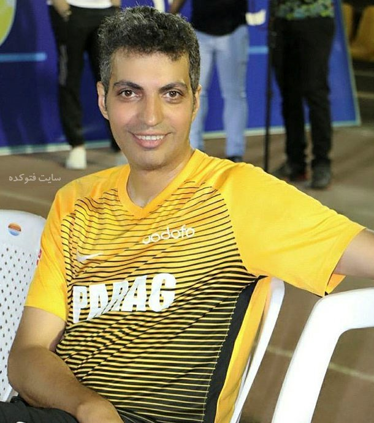

# Face Recognition

### I have implemented a model in this repository which can recognize the Iranian celebrities (which are in used dataset) by receiving photos of their faces.

* The dataset was generated in the `generate_dataset.py` file using photos of Iranian celebrities and the [DeepFace](https://github.com/serengil/deepface) library.

* Model was trained in `train_model.ipynb` using generated dataset (dataset\dataset.csv) and Tensorflow library.

## You can access to the model at [this address](https://drive.google.com/drive/folders/1XnMDl-6-kuxWTmPy6WERZtAQCICpLDUt?usp=drive_link)

### Loss and Accuracy

||Loss|Accuracy|
|---|---|---|
|Train|0.0051|0.9717|
|Test|0.0313|0.8699|

### Predict

* Input Image:



* Output :
```
'Adel FerdowsiPour'
```

### Celebrities

Here are the celebrities which used as dataset :
```
0.	Bahram_Radan
1.	Ehsan_Alikhani
2.	Behnam_Bani
3.	Asghar_Farhadi
4.	Ebi
5.	Bahare_Rahnama
6.	Ali_Khamenei
7.	Ali_Daei
8.	Dariush_Arjmand
9.	Adel_FerdowsiPour
10.	Golshifteh_Farahani
11.	Elham_Hamidi
12.	Elnaz_Shakerdoost
13.	Leyla_Hatami
14.	Mehran_Ghafourian
15.	Mahnaz_Afshar
16.	Javad_Khiabani
17.	Javad_Razavian
18.	Hootan_Shakiba
19.	Hamid_Lolaei
20.	Mohsen_Chavoshi
21.	Parinaz_Izadyar
22.	Parsa_Pirozfar
23.	Parviz_Parastooee
24.	Siamak_Ansari
25.	Tannaz_Tabatabaee
26.	Shahab_Hosseini
27.	Siavash_Ghomayshi
28.	Mehran_Modiri
29.	Taraneh_Alidoosti