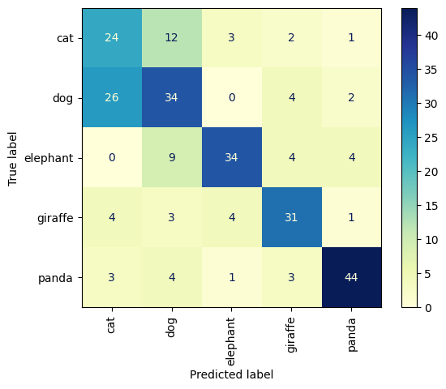
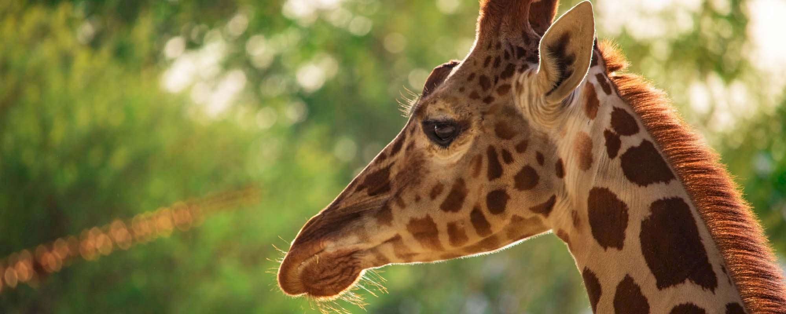
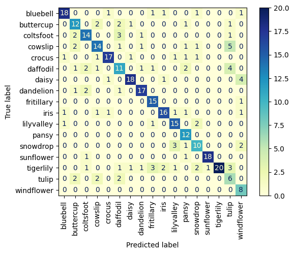

# 1. 5animal

### Working with 5animal image dataset :

* **Trained a CNN on augmented dataset and here are the results :**

    ||Loss|Accuracy|
    |---|---|---|
    |Train| 0.4874| 0.8100|
    |Validation|1.1153|0.6498|

    You can access to trained model [here](https://drive.google.com/file/d/1QQ9oEz6G9ULhJ3GFb1ldrrXIrAtaholX/view?usp=drive_link)

* **Confusion Matrix :**

    

* **Using trained model :** 

    Input :
    

    Output (predict) :
    ```
    1/1 [==============================] - 0s 75ms/step

    giraffe 
    ```

# 2. 17flower

### Working with 17flower image dataset :

* **Trained a CNN on dataset and augmented dataset and here is the comparison   :**

    ||Train Loss|Train Accuracy| Validation Loss | Validation Accuracy|
    |---|---|---|---|---|
    |main dataset| 4.6991e-04 | 1.0000 | 1.8445 | 0.6650|
    |augmented dataset|0.1012|0.9684|1.3053|0.7360|

    Despite the complete accuracy and very low loss on the main dataset in train, the augmented dataset has better accuracy and loss on the validation data.

* **Here are results of model trained on augmented model :**

    ||Train|Validation|Test|
    |---|---|---|---|
    |Loss|0.1012|1.3053|1.7148| 
    |Accuracy|0.9684|0.7360|0.7088|

    You can access to trained model [here](https://drive.google.com/file/d/1fc5zLjj6Xi9lKdyUF67nYRrooriwUA50/view?usp=drive_link)

* **Confusion Matrix :**

    