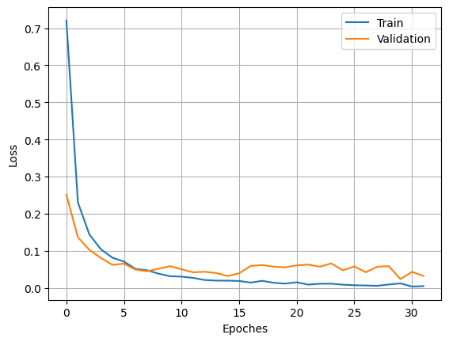
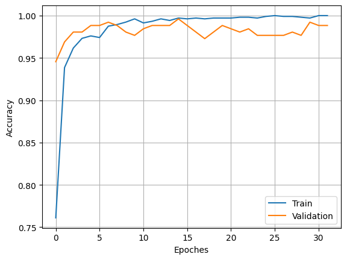
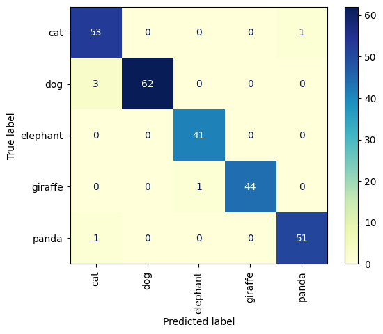
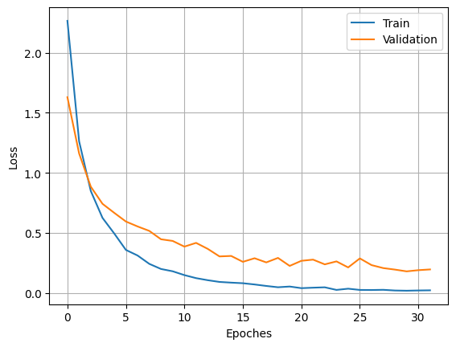
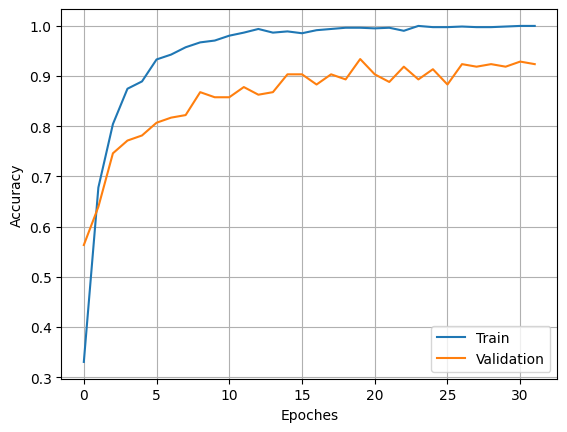
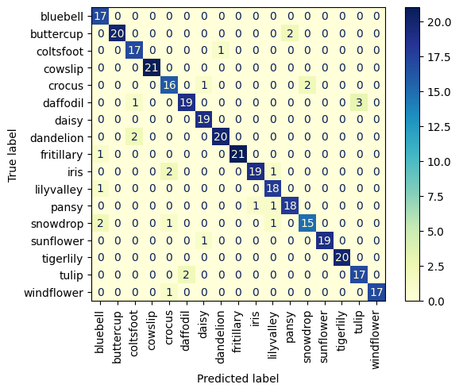
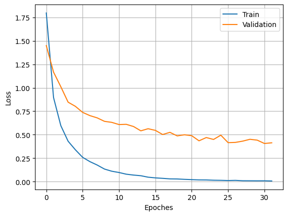
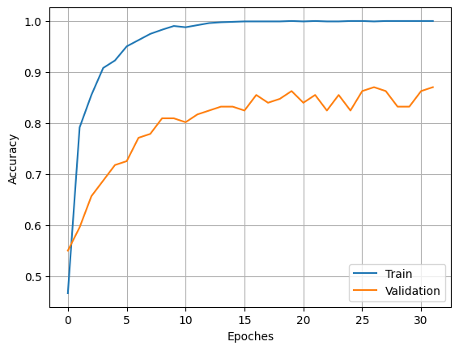
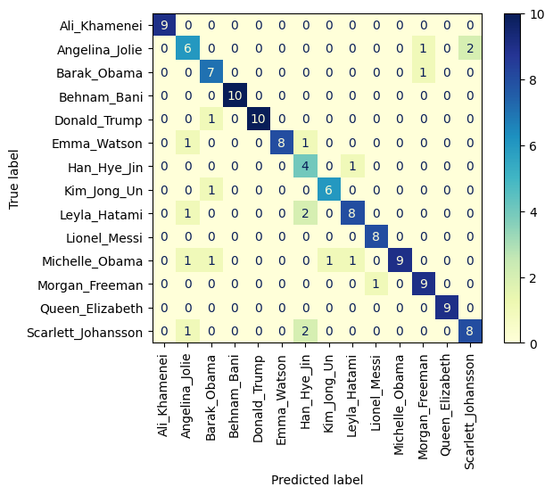

# *Transfer Learning*
Session 54 of PyLearn Course Assignments using **TransferLearning**

## 1. 5Animals

Retrain [last assignment](https://github.com/SobhanSaeedi7/DeepLearning/tree/main/3.Augmetation) dataset using **Transfer Learning** ( Base Model is [MobileNetV2](https://keras.io/api/applications/mobilenet/) ).

You access to updated model file(.h5) [here](https://drive.google.com/file/d/1gXZbCOG3nL09dCCuYdP1BbjaiSoqSonW/view?usp=drive_link) .

* Results:

|Loss|Designed CNN|Transfer Learning|
|---|---|---|
|Train|0.5809|0.0047|
|Validation|0.9590|0.0321|


|Accuracy|Designed CNN|Transfer Learning|
|---|---|---|
|Train|0.7649|1.0000|
|Validation|0.6615|0.9883|
 
|Loss Plot|Accuracy Plot|Confusion Matrix|
|---|---|---|
||||

## 2. 17flowers

Retrain [last assignment](https://github.com/SobhanSaeedi7/DeepLearning/tree/main/3.Augmetation) dataset using **Transfer Learning** ( Base Model is [MobileNetV2](https://keras.io/api/applications/mobilenet/) ).

You access to updated model file(.h5) [here](https://drive.google.com/file/d/1aEbQxNJDwY3-am_WKB178ZhnkReHp9Ae/view?usp=drive_link) .

* Results:

|Loss|Designed CNN|Transfer Learning|
|---|---|---|
|Train|0.1012|0.0218|
|Validation|1.3053|0.1957|
|Test|1.7148|0.2392| 

|Accuracy|Designed CNN|Transfer Learning|
|---|---|---|
|Train|0.9684|1.0000|
|Validation|0.7360|0.9239|
|Test|0.7088|0.9205|
 
|Loss Plot|Accuracy Plot|Confusion Matrix|
|---|---|---|
|| | 


## 3. 7-7-faces

Trained 7-7-faces image dataset with a model using **Transfer Learning** ( Base Model is [MobileNetV2](https://keras.io/api/applications/mobilenet/) ) .

You access to model file(.h5) [here](https://drive.google.com/file/d/1-59eITQyfz22BHjHSECMcawbKYARI3RR/view?usp=drive_link) .

* Results:

||Train|Validation|
|---|---|---|
|Loss|0.0071|0.4136|
|Accuracy|1.0000|0.8702|

|Loss Plot|Accuracy Plot|Confusion Matrix|
|---|---|---|
| | ||

* Prediction :

Input :


Output :
```
1/1 [==============================] - 0s 99ms/step
Lionel_Messi
```

## 4. Akhund or Human

Trained Akhund_Human image dataset with a model using **Transfer Learning** ( Base Model is [MobileNetV2](https://keras.io/api/applications/mobilenet/) ) .

You can see training progress in [W&B](https://wandb.ai/sobiteam/Akhund_Human?workspace=user-sobi-s-k2007) .

You access to model file(.h5) [here](https://drive.google.com/file/d/1NQGBDUVQkqsXvygjbHJyJqmcLrBoU-N2/view?usp=drive_link) .

You can also use [@Sobi_Akhund_Human_bot](https://t.me/Sobi_Akhund_Human_bot) when its source code is running to predict images .

* Results:

||Train|Validation|
|---|---|---|
|Loss|0.0022|0.7147|
|Accuracy|1.0000| 0.8667|

|Loss Plot|Accuracy Plot|Confusion Matrix|
|---|---|---|
| | ||
|
