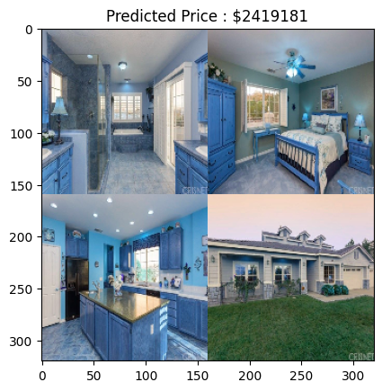

# CNN Regression
PyLEarn7 Course session 55 : Working on 2 **regression** image datasets and train them with **CNN** 
## Age Prediction
Preprocessing and train [UTKFace](https://www.kaggle.com/jangedoo/utkface-new) image dataset with a model using **Transfer Learning** ( Base Model is [MobileNetV2](https://keras.io/api/applications/mobilenet/) ) .

You can access to model file(.h5) [here](https://drive.google.com/file/d/1-59eITQyfz22BHjHSECMcawbKYARI3RR/view?usp=drive_link) .

* Results :

||Train|Validation|
|---|---|---|
|Loss|9.4044|8.5682

### You can have more data about training progress in [W&B](https://wandb.ai/sobiteam/Age_Prediction) .

* Prediction :

\](outputs/Grandpa_0.jpg)](pics/age_prediction_prediction.png)

## House Price Image Prediction

Follow this [tutorial](https://pyimagesearch.com/2019/01/28/keras-regression-and-cnns/) from PyImageSearch, preprocessed and trained and trained a CNN model on [House-dataset](https://github.com/emanhamed/Houses-dataset) and here is its [model](https://drive.google.com/file/d/18WNdUp5f-sUKX2kcqR7ngEgAXE0LGWih/view?usp=sharing) .

* Results and Prediction Example :

||Train|Validation|
|---|---|---|
|Loss|33.0408|54.8190

