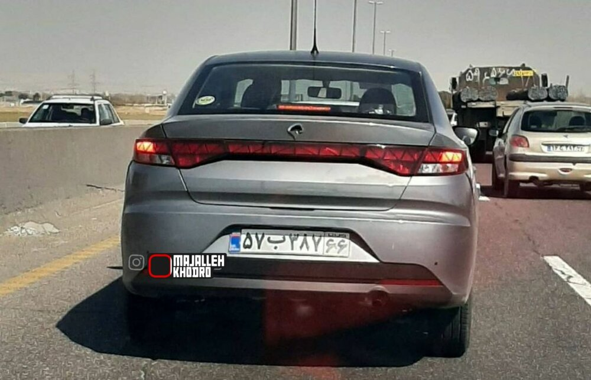
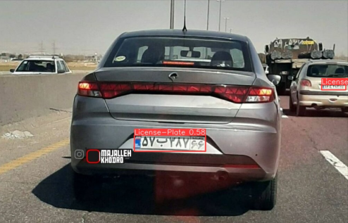
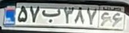
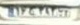
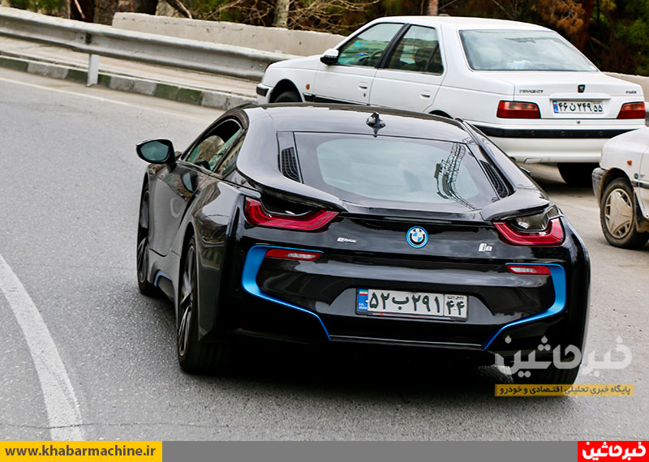
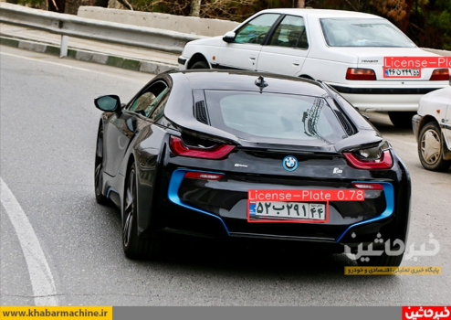
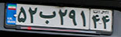
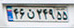

# Object Detection

PyLearn7 56th Session Assignment : **Object Detection**

## Persian License Plate Detection

Collected many images and labeled Persian Plates with [Roboflow](app.roboflow.com) and then trained the dataset using [Yolov8x](https://docs.ultralytics.com/) .

- Here are the results :

||Input|Output|
|---|---|---|
||||
|Cropped Plates|||

||Input|Output|
|---|---|---|
||||
|Cropped Plates|||