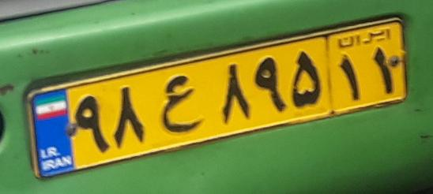

# Object Character Recognition
PyLearn7 online course Session 57 Assignment: **Learning OCR**

## easyOCR

We first used [easyOCR](https://github.com/JaidedAI/EasyOCR) library to recognize characters.

Here are result :

|input images: |||||
|---|---|---|---|---|
|Outputs: |'Rghts'|'P 688 CC', 'Autospace SRL', 'BMW & MINI Moldova'|'جه بخندد' ,'چرخ' ,'جه نخندد' ,'تولخند' ,'گردون'|'٤٩٦ب١٧'|

* The results are acceptable, but they still have few problems, so we have to use easyOCR source code and train it

## Deep Text Recognition Benchmark
Then we used [DTRB](https://github.com/clovaai/deep-text-recognition-benchmark) as recognition.

Here are result of DTRB using a [pretrained weights](https://drive.google.com/file/d/1pI4VjXYZCD24Uycmuw2ErBEAiAQHB_Et/view?usp=drive_link):
|input images: |||||
|---|---|---|---|---|
|Outputs: |protomicate|consect|consuptication|states|

* The results are very bad and unacceptable (of course DTRB doesn`t support Farsi)

* So we started training model using [IR-LPR](https://github.com/mut-deep/IR-LPR) dataset 

* IR-LPR dataset labels format was `.xml`, so I wrote a code to convert their format for DTRB and make its label english to train model better. You can access the code [here](https://drive.google.com/file/d/1wckfgnaCOFYosUGhsKrQubzpym_cGCep/view?usp=sharing) and also in this repository. 

* Also you can access to trained weights [here](https://drive.google.com/file/d/1CCsEgGRA-RnhxuGx3ESmeg5lM9m_zwfw/view?usp=drive_link)

result of training :
||Loss|
|---|---|
|Train|0.0234|
|Test|0.5046|
____
||Accuracy|
|---|---|
|Train (best)|80.710|
|Test|80.563|
___
Inference :
|Images:||  ||
|---|---|---|---|
||25t71433 |52w68911|98e89511|