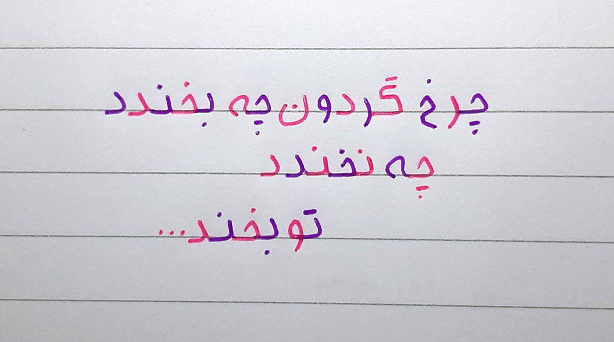

# Object Character Recognition
PyLearn7 online course Session 57 Assignment: **Learning OCR**

## easyOCR

We first used [easyOCR](https://github.com/JaidedAI/EasyOCR) library to recognize characters.

Here are result :

|input images: |||||
|---|---|---|---|---|
|Outputs: |||||

