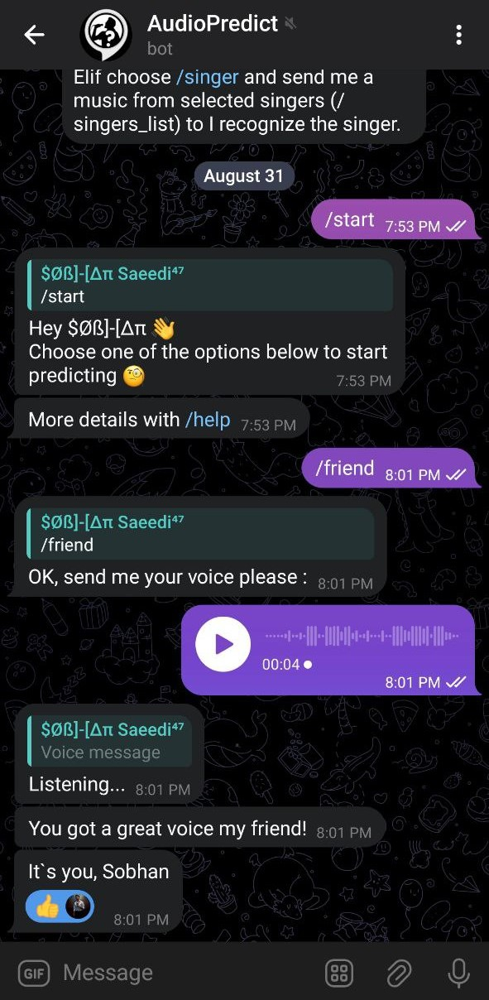
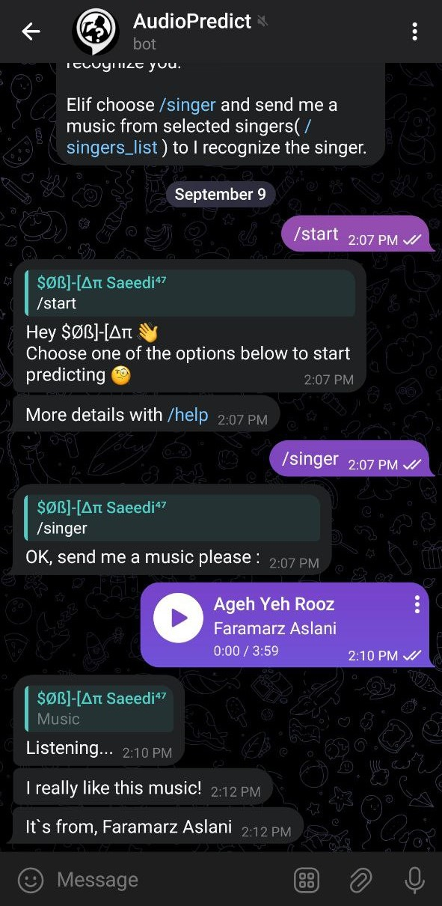

# 9. Audio Classification
PyLearn7 Course Assignment 59, 9th session of DeepLearning

## 1. Make Dataset
Make dataset using our voices:
I`ve done some preprocessing on voices (remove silence, convert formats...) using [Pydub](https://github.com/jiaaro/pydub) library and then split voices to 1 second chunks. [Here](https://drive.google.com/drive/folders/1jbMvdZRZwjSvCEl6FyIt8xsAIZw38P-g?usp=sharing) is the dataset.

## 2. Train Audios Dataset
I`ve trained the dataset using tensorflow and here are the results:
```
accuracy: 0.9904      loss: 0.0365 
val_accuracy: 0.9663  val_loss: 0.1309
```
* [Here]() is the trained model.
## 3. Persian Singers
I`ve done both of last steps on five Persian singers songs, just before them I spleeted songs using [Spleeter](https://drive.google.com/file/d/1bT8olJHX3OjoVFgVDPiellxTvAOg01Qb/view?usp=sharing) library.

Training Results:
```
accuracy: 0.9750      loss: 0.0772
val_accuracy: 0.9048  val_loss: 0.2973
```
* [Here](https://drive.google.com/file/d/1psfB0mU4BzGOXADIgFLpBHenSuJiDQxG/view?usp=sharing) is the trained model.
## Telegram Bot

You can connect `TelegramBot.py` to a telegram bot and use trained models to test them

|||
|---|---|